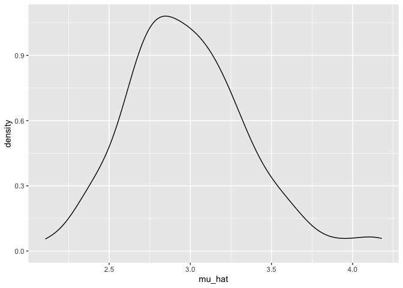
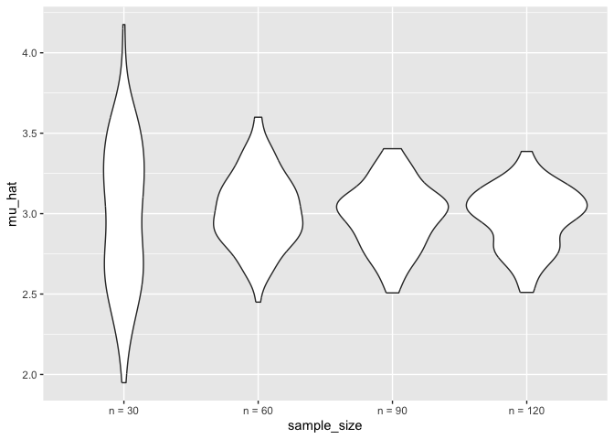
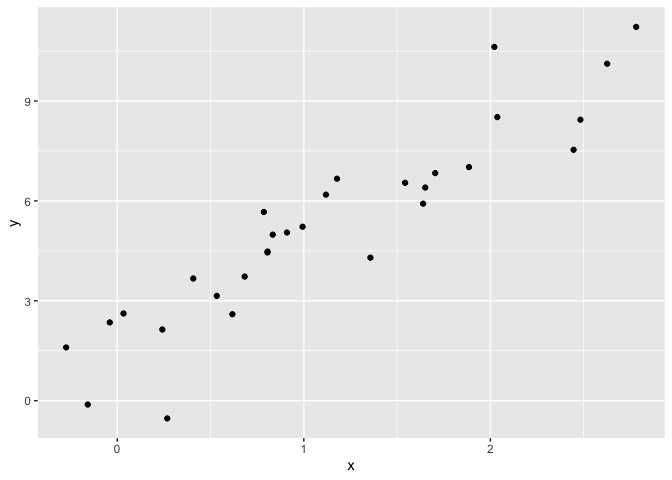
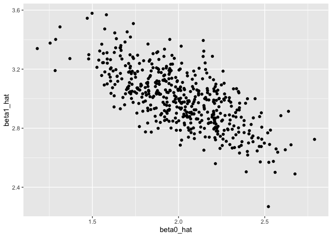

simulation
================
yz5248
2025-10-30

``` r
sim_mean_sd(n_subj = 400)
```

    ## # A tibble: 1 × 2
    ##   mu_hat sigma_hat
    ##    <dbl>     <dbl>
    ## 1   2.90      2.04

can i “verify” the central limit theorem

``` r
output = vector("list", 100)

for (i in 1:100) {
  output[[i]] = sim_mean_sd(30)
}

output
```

    ## [[1]]
    ## # A tibble: 1 × 2
    ##   mu_hat sigma_hat
    ##    <dbl>     <dbl>
    ## 1   3.80      1.44
    ## 
    ## [[2]]
    ## # A tibble: 1 × 2
    ##   mu_hat sigma_hat
    ##    <dbl>     <dbl>
    ## 1   3.01      2.39
    ## 
    ## [[3]]
    ## # A tibble: 1 × 2
    ##   mu_hat sigma_hat
    ##    <dbl>     <dbl>
    ## 1   2.66      2.10
    ## 
    ## [[4]]
    ## # A tibble: 1 × 2
    ##   mu_hat sigma_hat
    ##    <dbl>     <dbl>
    ## 1   3.00      2.08
    ## 
    ## [[5]]
    ## # A tibble: 1 × 2
    ##   mu_hat sigma_hat
    ##    <dbl>     <dbl>
    ## 1   3.15      2.04
    ## 
    ## [[6]]
    ## # A tibble: 1 × 2
    ##   mu_hat sigma_hat
    ##    <dbl>     <dbl>
    ## 1   2.59      1.89
    ## 
    ## [[7]]
    ## # A tibble: 1 × 2
    ##   mu_hat sigma_hat
    ##    <dbl>     <dbl>
    ## 1   3.66      2.05
    ## 
    ## [[8]]
    ## # A tibble: 1 × 2
    ##   mu_hat sigma_hat
    ##    <dbl>     <dbl>
    ## 1   3.03      2.09
    ## 
    ## [[9]]
    ## # A tibble: 1 × 2
    ##   mu_hat sigma_hat
    ##    <dbl>     <dbl>
    ## 1   2.28      1.77
    ## 
    ## [[10]]
    ## # A tibble: 1 × 2
    ##   mu_hat sigma_hat
    ##    <dbl>     <dbl>
    ## 1   2.41      2.26
    ## 
    ## [[11]]
    ## # A tibble: 1 × 2
    ##   mu_hat sigma_hat
    ##    <dbl>     <dbl>
    ## 1   2.94      2.43
    ## 
    ## [[12]]
    ## # A tibble: 1 × 2
    ##   mu_hat sigma_hat
    ##    <dbl>     <dbl>
    ## 1   3.44      1.71
    ## 
    ## [[13]]
    ## # A tibble: 1 × 2
    ##   mu_hat sigma_hat
    ##    <dbl>     <dbl>
    ## 1   2.12      2.01
    ## 
    ## [[14]]
    ## # A tibble: 1 × 2
    ##   mu_hat sigma_hat
    ##    <dbl>     <dbl>
    ## 1   2.87      2.22
    ## 
    ## [[15]]
    ## # A tibble: 1 × 2
    ##   mu_hat sigma_hat
    ##    <dbl>     <dbl>
    ## 1   3.21      1.86
    ## 
    ## [[16]]
    ## # A tibble: 1 × 2
    ##   mu_hat sigma_hat
    ##    <dbl>     <dbl>
    ## 1   2.69      1.95
    ## 
    ## [[17]]
    ## # A tibble: 1 × 2
    ##   mu_hat sigma_hat
    ##    <dbl>     <dbl>
    ## 1   3.13      1.76
    ## 
    ## [[18]]
    ## # A tibble: 1 × 2
    ##   mu_hat sigma_hat
    ##    <dbl>     <dbl>
    ## 1   2.58      1.64
    ## 
    ## [[19]]
    ## # A tibble: 1 × 2
    ##   mu_hat sigma_hat
    ##    <dbl>     <dbl>
    ## 1   3.30      2.16
    ## 
    ## [[20]]
    ## # A tibble: 1 × 2
    ##   mu_hat sigma_hat
    ##    <dbl>     <dbl>
    ## 1   2.99      2.29
    ## 
    ## [[21]]
    ## # A tibble: 1 × 2
    ##   mu_hat sigma_hat
    ##    <dbl>     <dbl>
    ## 1   2.71      2.22
    ## 
    ## [[22]]
    ## # A tibble: 1 × 2
    ##   mu_hat sigma_hat
    ##    <dbl>     <dbl>
    ## 1   3.24      1.76
    ## 
    ## [[23]]
    ## # A tibble: 1 × 2
    ##   mu_hat sigma_hat
    ##    <dbl>     <dbl>
    ## 1   2.73      1.80
    ## 
    ## [[24]]
    ## # A tibble: 1 × 2
    ##   mu_hat sigma_hat
    ##    <dbl>     <dbl>
    ## 1   2.80      1.77
    ## 
    ## [[25]]
    ## # A tibble: 1 × 2
    ##   mu_hat sigma_hat
    ##    <dbl>     <dbl>
    ## 1   2.89      2.34
    ## 
    ## [[26]]
    ## # A tibble: 1 × 2
    ##   mu_hat sigma_hat
    ##    <dbl>     <dbl>
    ## 1   2.82      1.58
    ## 
    ## [[27]]
    ## # A tibble: 1 × 2
    ##   mu_hat sigma_hat
    ##    <dbl>     <dbl>
    ## 1   2.89      1.77
    ## 
    ## [[28]]
    ## # A tibble: 1 × 2
    ##   mu_hat sigma_hat
    ##    <dbl>     <dbl>
    ## 1   2.93      2.02
    ## 
    ## [[29]]
    ## # A tibble: 1 × 2
    ##   mu_hat sigma_hat
    ##    <dbl>     <dbl>
    ## 1   2.84      1.80
    ## 
    ## [[30]]
    ## # A tibble: 1 × 2
    ##   mu_hat sigma_hat
    ##    <dbl>     <dbl>
    ## 1   2.94      1.93
    ## 
    ## [[31]]
    ## # A tibble: 1 × 2
    ##   mu_hat sigma_hat
    ##    <dbl>     <dbl>
    ## 1   2.84      1.57
    ## 
    ## [[32]]
    ## # A tibble: 1 × 2
    ##   mu_hat sigma_hat
    ##    <dbl>     <dbl>
    ## 1   2.89      1.38
    ## 
    ## [[33]]
    ## # A tibble: 1 × 2
    ##   mu_hat sigma_hat
    ##    <dbl>     <dbl>
    ## 1   3.13      1.82
    ## 
    ## [[34]]
    ## # A tibble: 1 × 2
    ##   mu_hat sigma_hat
    ##    <dbl>     <dbl>
    ## 1   3.15      1.87
    ## 
    ## [[35]]
    ## # A tibble: 1 × 2
    ##   mu_hat sigma_hat
    ##    <dbl>     <dbl>
    ## 1   3.47      2.35
    ## 
    ## [[36]]
    ## # A tibble: 1 × 2
    ##   mu_hat sigma_hat
    ##    <dbl>     <dbl>
    ## 1   3.16      1.85
    ## 
    ## [[37]]
    ## # A tibble: 1 × 2
    ##   mu_hat sigma_hat
    ##    <dbl>     <dbl>
    ## 1   2.85      1.70
    ## 
    ## [[38]]
    ## # A tibble: 1 × 2
    ##   mu_hat sigma_hat
    ##    <dbl>     <dbl>
    ## 1   3.00      1.75
    ## 
    ## [[39]]
    ## # A tibble: 1 × 2
    ##   mu_hat sigma_hat
    ##    <dbl>     <dbl>
    ## 1   2.86      1.93
    ## 
    ## [[40]]
    ## # A tibble: 1 × 2
    ##   mu_hat sigma_hat
    ##    <dbl>     <dbl>
    ## 1   3.43      1.90
    ## 
    ## [[41]]
    ## # A tibble: 1 × 2
    ##   mu_hat sigma_hat
    ##    <dbl>     <dbl>
    ## 1   2.48      2.08
    ## 
    ## [[42]]
    ## # A tibble: 1 × 2
    ##   mu_hat sigma_hat
    ##    <dbl>     <dbl>
    ## 1   3.34      2.23
    ## 
    ## [[43]]
    ## # A tibble: 1 × 2
    ##   mu_hat sigma_hat
    ##    <dbl>     <dbl>
    ## 1   3.13      1.92
    ## 
    ## [[44]]
    ## # A tibble: 1 × 2
    ##   mu_hat sigma_hat
    ##    <dbl>     <dbl>
    ## 1   3.38      2.01
    ## 
    ## [[45]]
    ## # A tibble: 1 × 2
    ##   mu_hat sigma_hat
    ##    <dbl>     <dbl>
    ## 1   3.00      1.50
    ## 
    ## [[46]]
    ## # A tibble: 1 × 2
    ##   mu_hat sigma_hat
    ##    <dbl>     <dbl>
    ## 1   3.19      2.25
    ## 
    ## [[47]]
    ## # A tibble: 1 × 2
    ##   mu_hat sigma_hat
    ##    <dbl>     <dbl>
    ## 1   2.90      1.82
    ## 
    ## [[48]]
    ## # A tibble: 1 × 2
    ##   mu_hat sigma_hat
    ##    <dbl>     <dbl>
    ## 1   3.29      1.98
    ## 
    ## [[49]]
    ## # A tibble: 1 × 2
    ##   mu_hat sigma_hat
    ##    <dbl>     <dbl>
    ## 1   2.59      1.84
    ## 
    ## [[50]]
    ## # A tibble: 1 × 2
    ##   mu_hat sigma_hat
    ##    <dbl>     <dbl>
    ## 1   3.22      1.72
    ## 
    ## [[51]]
    ## # A tibble: 1 × 2
    ##   mu_hat sigma_hat
    ##    <dbl>     <dbl>
    ## 1   2.75      1.69
    ## 
    ## [[52]]
    ## # A tibble: 1 × 2
    ##   mu_hat sigma_hat
    ##    <dbl>     <dbl>
    ## 1   3.35      1.79
    ## 
    ## [[53]]
    ## # A tibble: 1 × 2
    ##   mu_hat sigma_hat
    ##    <dbl>     <dbl>
    ## 1   2.93      1.92
    ## 
    ## [[54]]
    ## # A tibble: 1 × 2
    ##   mu_hat sigma_hat
    ##    <dbl>     <dbl>
    ## 1   2.69      1.84
    ## 
    ## [[55]]
    ## # A tibble: 1 × 2
    ##   mu_hat sigma_hat
    ##    <dbl>     <dbl>
    ## 1   3.07      1.88
    ## 
    ## [[56]]
    ## # A tibble: 1 × 2
    ##   mu_hat sigma_hat
    ##    <dbl>     <dbl>
    ## 1   2.65      2.22
    ## 
    ## [[57]]
    ## # A tibble: 1 × 2
    ##   mu_hat sigma_hat
    ##    <dbl>     <dbl>
    ## 1   3.38      1.61
    ## 
    ## [[58]]
    ## # A tibble: 1 × 2
    ##   mu_hat sigma_hat
    ##    <dbl>     <dbl>
    ## 1   2.28      2.07
    ## 
    ## [[59]]
    ## # A tibble: 1 × 2
    ##   mu_hat sigma_hat
    ##    <dbl>     <dbl>
    ## 1   3.30      2.56
    ## 
    ## [[60]]
    ## # A tibble: 1 × 2
    ##   mu_hat sigma_hat
    ##    <dbl>     <dbl>
    ## 1   2.98      2.54
    ## 
    ## [[61]]
    ## # A tibble: 1 × 2
    ##   mu_hat sigma_hat
    ##    <dbl>     <dbl>
    ## 1   3.03      1.96
    ## 
    ## [[62]]
    ## # A tibble: 1 × 2
    ##   mu_hat sigma_hat
    ##    <dbl>     <dbl>
    ## 1   2.93      2.12
    ## 
    ## [[63]]
    ## # A tibble: 1 × 2
    ##   mu_hat sigma_hat
    ##    <dbl>     <dbl>
    ## 1   2.81      2.01
    ## 
    ## [[64]]
    ## # A tibble: 1 × 2
    ##   mu_hat sigma_hat
    ##    <dbl>     <dbl>
    ## 1   2.49      2.28
    ## 
    ## [[65]]
    ## # A tibble: 1 × 2
    ##   mu_hat sigma_hat
    ##    <dbl>     <dbl>
    ## 1   2.91      1.97
    ## 
    ## [[66]]
    ## # A tibble: 1 × 2
    ##   mu_hat sigma_hat
    ##    <dbl>     <dbl>
    ## 1   2.62      1.74
    ## 
    ## [[67]]
    ## # A tibble: 1 × 2
    ##   mu_hat sigma_hat
    ##    <dbl>     <dbl>
    ## 1   3.24      2.01
    ## 
    ## [[68]]
    ## # A tibble: 1 × 2
    ##   mu_hat sigma_hat
    ##    <dbl>     <dbl>
    ## 1   3.25      1.72
    ## 
    ## [[69]]
    ## # A tibble: 1 × 2
    ##   mu_hat sigma_hat
    ##    <dbl>     <dbl>
    ## 1   2.81      1.30
    ## 
    ## [[70]]
    ## # A tibble: 1 × 2
    ##   mu_hat sigma_hat
    ##    <dbl>     <dbl>
    ## 1   3.14      2.48
    ## 
    ## [[71]]
    ## # A tibble: 1 × 2
    ##   mu_hat sigma_hat
    ##    <dbl>     <dbl>
    ## 1   2.58      1.69
    ## 
    ## [[72]]
    ## # A tibble: 1 × 2
    ##   mu_hat sigma_hat
    ##    <dbl>     <dbl>
    ## 1   2.92      2.00
    ## 
    ## [[73]]
    ## # A tibble: 1 × 2
    ##   mu_hat sigma_hat
    ##    <dbl>     <dbl>
    ## 1   2.95      1.97
    ## 
    ## [[74]]
    ## # A tibble: 1 × 2
    ##   mu_hat sigma_hat
    ##    <dbl>     <dbl>
    ## 1   3.15      1.76
    ## 
    ## [[75]]
    ## # A tibble: 1 × 2
    ##   mu_hat sigma_hat
    ##    <dbl>     <dbl>
    ## 1   3.04      2.12
    ## 
    ## [[76]]
    ## # A tibble: 1 × 2
    ##   mu_hat sigma_hat
    ##    <dbl>     <dbl>
    ## 1   2.82      2.48
    ## 
    ## [[77]]
    ## # A tibble: 1 × 2
    ##   mu_hat sigma_hat
    ##    <dbl>     <dbl>
    ## 1   3.06      1.60
    ## 
    ## [[78]]
    ## # A tibble: 1 × 2
    ##   mu_hat sigma_hat
    ##    <dbl>     <dbl>
    ## 1   3.31      2.09
    ## 
    ## [[79]]
    ## # A tibble: 1 × 2
    ##   mu_hat sigma_hat
    ##    <dbl>     <dbl>
    ## 1   2.88      2.07
    ## 
    ## [[80]]
    ## # A tibble: 1 × 2
    ##   mu_hat sigma_hat
    ##    <dbl>     <dbl>
    ## 1   3.06      1.62
    ## 
    ## [[81]]
    ## # A tibble: 1 × 2
    ##   mu_hat sigma_hat
    ##    <dbl>     <dbl>
    ## 1   3.48      2.04
    ## 
    ## [[82]]
    ## # A tibble: 1 × 2
    ##   mu_hat sigma_hat
    ##    <dbl>     <dbl>
    ## 1   3.00      2.04
    ## 
    ## [[83]]
    ## # A tibble: 1 × 2
    ##   mu_hat sigma_hat
    ##    <dbl>     <dbl>
    ## 1   3.56      2.03
    ## 
    ## [[84]]
    ## # A tibble: 1 × 2
    ##   mu_hat sigma_hat
    ##    <dbl>     <dbl>
    ## 1   3.09      1.97
    ## 
    ## [[85]]
    ## # A tibble: 1 × 2
    ##   mu_hat sigma_hat
    ##    <dbl>     <dbl>
    ## 1   3.31      1.97
    ## 
    ## [[86]]
    ## # A tibble: 1 × 2
    ##   mu_hat sigma_hat
    ##    <dbl>     <dbl>
    ## 1   3.19      2.16
    ## 
    ## [[87]]
    ## # A tibble: 1 × 2
    ##   mu_hat sigma_hat
    ##    <dbl>     <dbl>
    ## 1   2.99      2.18
    ## 
    ## [[88]]
    ## # A tibble: 1 × 2
    ##   mu_hat sigma_hat
    ##    <dbl>     <dbl>
    ## 1   3.04      2.59
    ## 
    ## [[89]]
    ## # A tibble: 1 × 2
    ##   mu_hat sigma_hat
    ##    <dbl>     <dbl>
    ## 1   3.20      2.17
    ## 
    ## [[90]]
    ## # A tibble: 1 × 2
    ##   mu_hat sigma_hat
    ##    <dbl>     <dbl>
    ## 1   3.16      1.95
    ## 
    ## [[91]]
    ## # A tibble: 1 × 2
    ##   mu_hat sigma_hat
    ##    <dbl>     <dbl>
    ## 1   3.68      1.94
    ## 
    ## [[92]]
    ## # A tibble: 1 × 2
    ##   mu_hat sigma_hat
    ##    <dbl>     <dbl>
    ## 1   2.97      1.83
    ## 
    ## [[93]]
    ## # A tibble: 1 × 2
    ##   mu_hat sigma_hat
    ##    <dbl>     <dbl>
    ## 1   2.62      1.37
    ## 
    ## [[94]]
    ## # A tibble: 1 × 2
    ##   mu_hat sigma_hat
    ##    <dbl>     <dbl>
    ## 1   3.38      1.88
    ## 
    ## [[95]]
    ## # A tibble: 1 × 2
    ##   mu_hat sigma_hat
    ##    <dbl>     <dbl>
    ## 1   2.45      1.77
    ## 
    ## [[96]]
    ## # A tibble: 1 × 2
    ##   mu_hat sigma_hat
    ##    <dbl>     <dbl>
    ## 1   3.23      1.89
    ## 
    ## [[97]]
    ## # A tibble: 1 × 2
    ##   mu_hat sigma_hat
    ##    <dbl>     <dbl>
    ## 1   3.50      1.80
    ## 
    ## [[98]]
    ## # A tibble: 1 × 2
    ##   mu_hat sigma_hat
    ##    <dbl>     <dbl>
    ## 1   3.25      1.75
    ## 
    ## [[99]]
    ## # A tibble: 1 × 2
    ##   mu_hat sigma_hat
    ##    <dbl>     <dbl>
    ## 1   3.67      1.30
    ## 
    ## [[100]]
    ## # A tibble: 1 × 2
    ##   mu_hat sigma_hat
    ##    <dbl>     <dbl>
    ## 1   2.68      1.93

``` r
sim_results = bind_rows(output)

output |>
  bind_rows() |>
  ggplot(aes(x = mu_hat)) +
  geom_density()
```

<!-- -->

try to repeat with a map statement

``` r
sim_results_df = 
  expand_grid(
    sample_size = 30,
    iter = 1:100
  ) |>
  mutate(
    results = map(sample_size, sim_mean_sd)
  ) |>
  unnest(results)
```

``` r
sim_results_df = 
  expand_grid(
    iter = 1:100,
    sample_size = c(30, 60, 90, 120)
  ) |>
  mutate(
    results = map(sample_size, sim_mean_sd)
  ) |>
  unnest(results)
```

``` r
sim_results_df |>
  mutate(
    sample_size = str_c("n = ", sample_size),
    sample_size = fct_inorder(sample_size)
  ) |>
  ggplot(aes(x = sample_size, y = mu_hat)) +
  geom_violin()
```

<!-- -->

``` r
sim_results_df |>
  group_by(sample_size) |>
  summarise(
    emp_mean = mean(mu_hat),
    emp_se = sd(mu_hat)
  )
```

    ## # A tibble: 4 × 3
    ##   sample_size emp_mean emp_se
    ##         <dbl>    <dbl>  <dbl>
    ## 1          30     2.99  0.457
    ## 2          60     3.02  0.232
    ## 3          90     2.98  0.204
    ## 4         120     2.98  0.192

# Simple Linear Regression

``` r
sim_df =
  tibble(
    x = rnorm(30, mean = 1, sd = 1),
    y = 2 + 3* x +rnorm(30, 0, 1)
  )

sim_df |>
  ggplot(aes(x = x, y = y)) +
  geom_point()
```

<!-- -->

``` r
slr_fit = lm (y ~ x, data = sim_df)

coef(slr_fit)
```

    ## (Intercept)           x 
    ##    1.712325    3.125875

``` r
sim_regression = function(n_subj, beta0 = 2, beta1 = 3) {
  
  sim_data = 
    tibble(
      x = rnorm(n_subj, mean = 1, sd = 1),
      y = beta0 + beta1 * x + rnorm(n_subj, 0, 1)
    )
  
  ls_fit = lm(y ~ x, data = sim_data)
  
  tibble(
    beta0_hat = coef(ls_fit)[1],
    beta1_hat = coef(ls_fit)[2]
  )
}
```

``` r
sim_regression(n_subj = 30)
```

    ## # A tibble: 1 × 2
    ##   beta0_hat beta1_hat
    ##       <dbl>     <dbl>
    ## 1      2.16      2.86

``` r
output = vector("list", length = 500)

for (i in 1:500) {
  output[[i]] = sim_regression(n_subj = 30)
}

output |>
  bind_rows()
```

    ## # A tibble: 500 × 2
    ##    beta0_hat beta1_hat
    ##        <dbl>     <dbl>
    ##  1      2.41      2.84
    ##  2      2.05      3.05
    ##  3      1.76      3.07
    ##  4      1.86      3.23
    ##  5      2.18      2.97
    ##  6      2.06      2.72
    ##  7      1.92      3.16
    ##  8      2.22      2.83
    ##  9      2.00      3.02
    ## 10      1.53      3.22
    ## # ℹ 490 more rows

``` r
slr_sim_results_df = 
  expand_grid(
    iter = 1:500,
    sample_size = 30
  ) |>
  mutate(
    results = map(sample_size, sim_regression)
  ) |>
  unnest(results)

slr_sim_results_df |>
  ggplot(aes(x = beta0_hat, y = beta1_hat)) +
  geom_point()
```

<!-- -->

example

``` r
birthdays = sample(1:365, 5, replace = TRUE)

length(unique(birthdays)) < 5
```

    ## [1] FALSE
